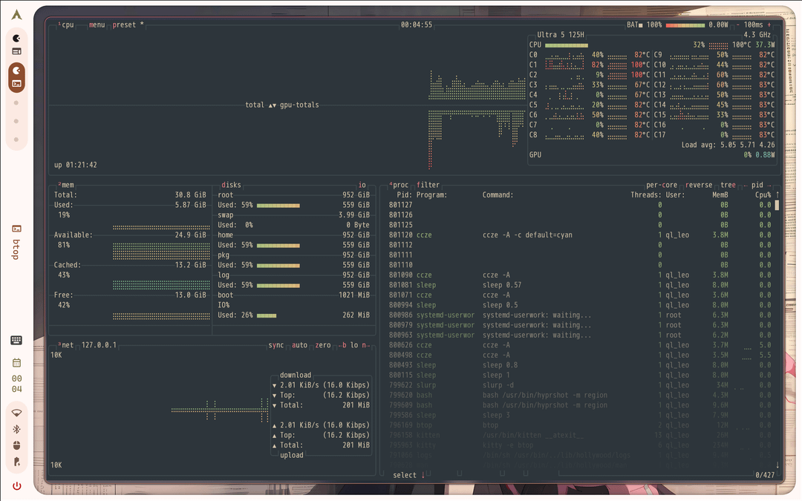
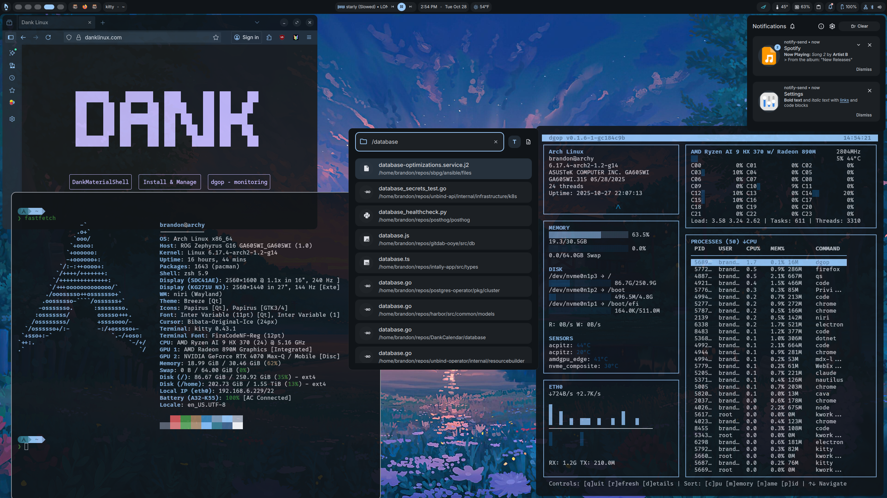

# Quickshell + AwesomeWM/Xorg — Compatibility Research & Component Guide

Goal: replace Polybar (top bar), Rofi (launcher + control menus), and
Dunst (notifications) with a Quickshell-based setup, while keeping
**AwesomeWM as the window manager** on **X11/Xorg** (no Wayland, no
compositor switch). This document covers: (1) whether Quickshell actually
works here, verified hands-on; (2) a plain-English glossary of the
building blocks; (3) a catalog of existing community shells to draw
ideas/code from; (4) a concrete module list for the three things
originally flagged as priorities (control panel, top bar, launcher) plus
suggestions for "other components." The concrete architecture/build plan
based on all of this now lives in `plan.md`, and the full options menu for
every surface (including later, more specific direction — two launcher
styles, a specific top-bar visual reference, a customizable quick-launch
menu, Dunst being fully dropped in favor of a native notification center,
and a switchable lock screen) lives in `decisions.md`.

---

## 1. Does Quickshell actually work with AwesomeWM + X11? (verified, not guessed)

**Short answer: yes, with real caveats.** This was tested live on servalws,
not just read about.

### What Quickshell is

Quickshell is not a pre-built bar/launcher like Polybar or Waybar. It's a
**toolkit** — you write your bar/launcher/panel yourself in QML (Qt's UI
language), and Quickshell gives you the building blocks (window types,
system integrations like audio/bluetooth/battery, process running, etc.).
This means more work up front than "install a theme," but also means the
end result can be exactly shaped to your setup instead of you adapting to
someone else's assumptions.

Officially, Quickshell states it supports **"Wayland and X11 for windowing"**
— X11 is a first-class (if less-featured) backend, not an unsupported
side-case. Confirmed on the [official About page](https://quickshell.org/about/).

### Live test performed on servalws (2026-07-05)

A minimal Quickshell bar was launched directly against the running
AwesomeWM/Xorg session:

```qml
import Quickshell
import QtQuick

PanelWindow {
  anchors { top: true; left: true; right: true }
  implicitHeight: 30
  color: "#2d353b"
  exclusiveZone: 30
  Text { anchors.centerIn: parent; text: "Quickshell X11 test bar"; color: "#d3c6aa" }
}
```

Result, confirmed via `awesome-client`, `xwininfo`, and screenshots:

- The window **rendered correctly** — dark bar, centered text, right size.
- It **reserved real screen space** (an X11 "strut"), exactly like Polybar
  does today. `awesome-client` showed both monitors' workareas shift down
  by the bar's height *while the test was running*, and `xprop`/`xwininfo`
  confirmed a real `_NET_WM_STRUT_PARTIAL`-equivalent reservation was in
  effect. This is the single most important fact for a bar to be usable —
  without it, windows would render underneath/behind the bar.
- **Caveat found:** the strut reservation applied to *both* monitors even
  though the panel window only existed on the primary monitor. This is
  classic X11 behavior (struts are a per-root-window concept, not
  inherently per-monitor aware) rather than a bug — it just means a
  multi-monitor Quickshell bar setup needs to explicitly create one
  `PanelWindow` per screen (via a `Variants { model: Quickshell.screens }`
  block — see glossary below) rather than relying on one window to "know"
  about monitor boundaries the way a Wayland layer-shell bar would.
- After killing the test window, AwesomeWM's cached workarea needed a
  reload (`Super+Shift+R`, which already existed as a keybind) to fully
  recompute — a minor housekeeping note for whoever builds/removes bars
  during iteration, not a blocker.

### What is NOT available on X11 (documented limitation, not tested further since it's not relevant here)

Quickshell ships built-in **workspace management integrations** for
**Hyprland**, **i3**, and **Sway** only (`Quickshell.Hyprland`,
`Quickshell.I3` modules). There is no built-in `Quickshell.Awesome` module.
This means: audio, bluetooth, battery, notifications, and system tray all
work out of the box on X11 (they talk to system services like PipeWire,
BlueZ, UPower — not to the window manager). But **workspace/tag indicators
require a small custom integration**, same as any unsupported WM. Quickshell's
own FAQ explicitly covers this case ("Work with an unsupported WM") and
the answer is: use `Quickshell.Io`'s `Process` or `Socket` types to talk to
AwesomeWM yourself — in practice this means shelling out to `awesome-client`
(which you already use extensively in your own scripts) or, more efficiently,
opening a persistent connection to AwesomeWM's D-Bus/socket interface. This
is a well-worn path — DankMaterialShell and others do the equivalent thing
for other niche compositors — but it is real, scoped work, not a checkbox.

### Real-world precedent: people already run Quickshell on X11 tiling WMs

Not just theoretically possible — found and read actual reports:
- A `bspwm` user's post titled *"Finally touched quickshell"* on r/unixporn
  explicitly notes Quickshell has "an inbuilt x11 integration (though it is
  not highly featured)".
- Another r/unixporn post, *"[bspwm] Quickshell + Matugen barebones"*, is a
  bspwm+Quickshell rice with the top comment asking "is quickshell for x11?
  Here it is" — i.e. it's understood as a known-working but less-common path.
- A comment on r/archlinux (in a thread about NVIDIA/Wayland pain) states
  plainly: "Quickshell works on xorg."

Net assessment: this is a legitimate, working, if slightly less-traveled
path. You will be assembling more of the pieces yourself than someone on
Hyprland copy-pasting a pre-built shell, but nothing about your AwesomeWM +
X11 setup blocks it.

---

## 2. Plain-English glossary of Quickshell building blocks

You said you're new to this, so here's what the jargon actually means before
the module list. Skip this section if you just want the recommendations.

- **QML** — the language you write Quickshell configs in. Think of it like
  HTML/CSS had a baby with a programming language: you describe boxes,
  text, and images, and you can also write real logic (`if`, loops,
  functions) inline. Not as scary as it sounds once you see one example —
  the [Quickshell tutorial](https://www.tonybtw.com/tutorial/quickshell/)
  builds a working bar with clock/CPU/memory in about 60 lines.
- **`shell.qml`** — the entry-point file Quickshell loads, similar to how
  `rc.lua` is AwesomeWM's entry point or `config.ini` is Polybar's.
- **`PanelWindow`** — the window type for anything that should dock to a
  screen edge and reserve space: your top bar, a sidebar, a dock. This is
  the direct equivalent of a Polybar bar.
- **`FloatingWindow`** — a normal floating window that does NOT reserve
  space and can be positioned/sized freely — this is what you'd use for a
  launcher popup, a control-panel dropdown, an OSD, etc. Equivalent to a
  Rofi window.
- **`exclusiveZone` / anchors** — how a `PanelWindow` says "reserve this
  many pixels of screen space for me" and "which edges I'm attached to."
  This is the direct equivalent of what Polybar does automatically for you
  — in Quickshell you set it explicitly, which is more control but also
  more to remember.
- **`Process`** — runs a shell command (like `pactl`, `nmcli`,
  `bluetoothctl`, or your own scripts) and lets Quickshell read its output.
  This is exactly what your existing `rofi-audio-menu.sh` etc. do already —
  Quickshell can literally call the same scripts you already have, or you
  can move that logic into QML directly using Quickshell's built-in
  services (see below) for less shell-scripting and live-updating data
  instead of "run this script every N seconds."
- **Built-in "Services"** (`Quickshell.Services.Pipewire`,
  `Quickshell.Bluetooth`, `Quickshell.Services.UPower`,
  `Quickshell.Services.Notifications`, `Quickshell.Services.SystemTray`,
  `Quickshell.Services.Mpris`) — these are pre-built, live-updating
  connections to real system services, so instead of polling
  `pactl get-sink-volume` every 2 seconds with a `Timer`, the volume slider
  just *reacts* instantly when PipeWire's volume actually changes. This is
  the biggest practical upgrade over your current Rofi-script-based menus:
  today, opening `rofi-audio-menu.sh` re-queries everything fresh each time
  you open it; a live Quickshell panel could show current volume/battery/
  network state continuously, without you having to open anything.
- **`Timer`** — same concept as a cron job but inside the UI: "run this
  action every N milliseconds." Used for a clock, or for polling something
  that doesn't have a live-service (e.g. CPU%, which has no push-based
  service and needs periodic polling of `/proc/stat`).
- **`Repeater`** — takes a list (e.g. "5 workspaces" or "3 bluetooth
  devices") and stamps out one copy of a UI element per item. This is how
  you'd draw 5 workspace buttons or a list of paired devices without
  writing the same code 5 times.
- **`IpcHandler`** — lets you define functions inside Quickshell that can be
  triggered from the outside via a terminal command (`qs ipc call ...`).
  Useful for wiring AwesomeWM keybinds to Quickshell actions — e.g.
  `Super+Space` in `keys.lua` could call `qs ipc call launcher toggle`
  instead of `rofi -show drun`.
- **"Singleton"** — a piece of shared state (like "the current theme
  colors" or "the current volume") that's defined once and can be read from
  anywhere in your config, instead of every widget re-fetching it itself.
  This is the Quickshell equivalent of your current `theme/colors.lua` +
  `colors.ini` + `colors.rasi` — one theme file that everything reads from,
  except live instead of requiring `theme-apply` to rewrite multiple files.
- **`Variants` + `Quickshell.screens`** — the mechanism for "create one copy
  of this bar per monitor, and handle monitors being plugged/unplugged."
  Given your dual-monitor setup and the strut caveat found in testing, this
  is not optional for your bar — it's the correct pattern from day one.

---

## 3. Existing community shells (what to look at, not necessarily install as-is)

None of these run on X11/AwesomeWM out of the box — they're all built and
tested primarily for Wayland compositors (Hyprland/Niri/Sway). But their
**source code is the best possible reference** for how to structure
modules, theme tokens, and IPC — you can read/borrow QML patterns from them
even though you can't run their launchers verbatim (they call
`Hyprland.dispatch(...)` etc. that won't exist on AwesomeWM).

| Shell | Style | What's notable | Link |
|---|---|---|---|
| **Caelestia** | Polished, animated, "material-ish" | Extremely popular (10k+ GitHub stars), full-featured: bar, launcher, dashboard, lock screen, notification center. Good reference for *how a full-featured control-panel/dashboard is structured* even though it's Hyprland-only. | [github.com/caelestia-dots/shell](https://github.com/caelestia-dots/shell) |
| **DankMaterialShell (DMS)** | Google "Material Design" look | Very complete: bar, dock, control center, notifications, lock screen, plugin system. Good reference for a control-center/settings-panel layout. | [github.com/AvengeMedia/DankMaterialShell](https://github.com/AvengeMedia/DankMaterialShell) |
| **Noctalia** | "Quiet by design" — deliberately minimal | Closest in spirit to what you described wanting ("minimal but modern"). v4 is Quickshell-based (v5 is moving to a different runtime, so reference the v4 docs/code specifically). Good reference for restraint — fewer widgets, calmer visuals. | [docs.noctalia.dev/v4](https://docs.noctalia.dev/v4/) |
| **bjarneo/quickshell ("desktop")** | Minimal single-process bar + command-palette launcher | Smaller, more hackable codebase than the above three (one dev, not a large community project). The "omni-menu" is essentially a from-scratch Rofi replacement with fuzzy search, categories, and quick-toggle tiles — structurally very close to what you'd want for "launcher + control panel" combined. Good starting reference for code you could actually adapt, not just admire. | [github.com/bjarneo/quickshell](https://github.com/bjarneo/quickshell) (see `desktop/` subfolder) |
| **Aelyx Shell** | Listed as Hyprland-only but worth a glance | Smaller/newer project, useful for seeing yet another take on module layout. | [github.com/xZepyx/aelyx-shell](https://github.com/xZepyx/aelyx-shell) |

A broader comparison table (with preview images) of ~7 Quickshell/Fabric-based
shells is maintained at
[codeberg.org/domsch1988/awesome_shells](https://codeberg.org/domsch1988/awesome_shells)
— useful if you want to browse further before committing to a visual
direction.

Downloaded reference screenshots (saved locally so you don't need to load
each site to compare visual style):


*Caelestia — animated, layered dashboard/control-center style.*


*DankMaterialShell — Material Design bar + widgets, more colorful/rounded.*

(Noctalia's own screenshot links returned a broken/expired path when
fetched for this doc — browse
[docs.noctalia.dev/v4](https://docs.noctalia.dev/v4/) directly for current
visuals; it's the "minimal" reference point of the three.)

**None of these are drop-in installs for you.** They assume Hyprland/Niri
IPC for workspaces and usually assume `swaync`/Wayland-only notification
paths. The realistic plan is: build your own `shell.qml` from scratch
(like the tutorial does), borrowing visual/structural ideas and occasionally
copying small self-contained QML components (a volume slider, a battery
icon renderer) from these projects where they don't depend on
Wayland-specific APIs.

---

## 4. Module/component catalog for your three priorities

### A. Control panel (your stated top priority — "make it easier to configure the system manually")

This is the Quickshell replacement for your `rofi-*-menu.sh` scripts
(audio/wifi/bluetooth/power/calendar) — but instead of separate popup menus
triggered by separate keybinds, a control panel is usually **one panel with
multiple sections/tabs**, opened by a single keybind (e.g. `Super+Shift+Space`),
showing live status for everything at once.

| Module (plain-English name) | What it does | Quickshell building block | Replaces today |
|---|---|---|---|
| **Volume/audio tile** | Shows current volume, mute state, output device; slider to adjust; click to switch output/input device | `Quickshell.Services.Pipewire` (live, no polling) | `rofi-audio-menu.sh` |
| **Network/Wi-Fi tile** | Shows connection status, SSID, signal strength; list of nearby networks to click-connect | `Quickshell.Networking` — confirmed real and working on this machine (verified live in Section 1's note below the table; correctly detects NetworkManager as backend) | `rofi-wifi-menu.sh` |
| **Bluetooth tile** | Power toggle, paired devices list, connect/disconnect, pairing | `Quickshell.Bluetooth` (built-in, talks to BlueZ directly — genuinely live, no polling) | `rofi-bluetooth-menu.sh` |
| **Battery/power tile** | Charge %, charging state, time remaining; click for power menu (suspend/restart/poweroff) | `Quickshell.Services.UPower` (built-in, live) | battery portion of Polybar + `rofi-power-menu.sh` |
| **Power profile tile** | Performance/Balanced/Battery Saver switch | `Quickshell.Services.UPower`'s `PowerProfiles` type (built-in) — can likely replace your current `system76-power` shell-out entirely | power-profile portion of `rofi-power-menu.sh` |
| **Brightness slider** | Screen brightness control | No built-in service — wrap `brightnessctl` via `Process`, same pattern as today | (new — you don't have this today) |
| **Do Not Disturb / notification toggle** | Mute notifications, see notification history | `Quickshell.Services.Notifications` (built-in notification *server* — see note below) | replaces Dunst (settled direction — see `decisions.md` §9: Dunst is being dropped, with a dedicated `Mod+N` navigable notification center) |
| **Quick settings row** (small icon-only toggles) | One-tap Wi-Fi/Bluetooth/DND on-off, no full menu | Same services as above, just rendered smaller | new convenience, not present today |
| **Calendar tile** | Small month calendar, click for date/timestamp copy actions | Plain QML `Text`/`Grid`, no special service needed — you already have the logic in `rofi-calendar.sh`, just re-rendered | `rofi-calendar.sh` |
| **System tray** | Icons for background apps (Syncthing, 1Password, etc. if they use tray icons) | `Quickshell.Services.SystemTray` (built-in, implements the `StatusNotifierItem` spec) | You don't currently have a tray in Polybar — this would be new |

**Note on the notification server:** using Quickshell's `NotificationServer`
type to build native notification popups will conflict with **Dunst** —
only one process can own the "notifications" D-Bus name at a time. This was
initially flagged as an open decision; it has since been settled (see
`decisions.md` §9): Dunst is being dropped in favor of a Quickshell-native
notification center with a dedicated `Mod+N` keybind for a navigable
history view. The technical constraint stated above still matters
operationally — Dunst's autostart and Quickshell's notification server
must be swapped in the *same* step during rollout (see `plan.md` §5, step
4), not gradually, or notifications would silently go nowhere in between.

**Note on `Quickshell.Networking`/`Quickshell.Bluetooth` — verified live,
not just read about:** your existing prototype
(`quickshell/.config/shell.qml`) imports `Quickshell.Bluetooth` and
`Quickshell.Networking`. `Quickshell.Bluetooth` is documented in the
official docs; `Quickshell.Networking` was not found in the official
v0.2.1 docs index during this research pass, so rather than leave it as a
guess, I ran your actual prototype file on servalws
(`quickshell -p shell.qml`) and called its own built-in `services inventory`
IPC function. It returned real, live data:

```json
{
  "audio": {"service": "Quickshell.Services.Pipewire", "ready": true,
             "sinkDescription": "Built-in Audio Analog Stereo",
             "volumePercent": 100, "muted": false},
  "bluetooth": {"service": "Quickshell.Bluetooth", "hasDefaultAdapter": false,
                 "enabled": false},
  "network": {"service": "Quickshell.Networking", "backend": "NetworkManager",
               "wifiEnabled": false, "connectivity": "Unknown"},
  "power": {"service": "Quickshell.Services.UPower", "onBattery": false}
}
```

Confirmed on this machine's installed build (Quickshell 0.3.0, Fedora COPR
`errornointernet/quickshell`): **`Quickshell.Networking` is real and works**,
and it correctly detected `NetworkManager` as the backend. Bluetooth showed
`hasDefaultAdapter: false` at test time — not a Quickshell failure, just
reflecting that no Bluetooth adapter happened to be reported as default at
that moment (Wi-Fi/Bluetooth radios can be independently toggled; this
wasn't investigated further since it's not blocking). Pipewire and UPower
both returned fully live, correct data (actual current volume, actual sink
name, actual AC/battery state) on the first call, no polling delay. This is
strong evidence the service layer this whole plan depends on is solid on
your exact machine and Quickshell build — not just "should work in theory."

### B. Top bar (Polybar replacement)

| Module | What it shows | Building block | Notes |
|---|---|---|---|
| **Workspace/tag indicator** | Which of your 5 tags is active, per monitor, clickable | Custom (no built-in AwesomeWM module) — needs a small script/socket bridge, see Section 1 | This is your chance to fix the "1 2 3 4 5 1 2 3 4 5" duplicate-label problem properly, since you control the rendering logic instead of inheriting Polybar's raw desktop count |
| **Window title / focused app** | Name of the currently focused window | Custom — `awesome-client` query or AwesomeWM signal bridge | You don't have this in Polybar today; it's what was filling that "dead space" you noticed |
| **Clock** | Date/time | `SystemClock` (built-in, no shell-out needed) | Cleaner than your current `internal/date` polling |
| **CPU/Memory** | Usage % | No built-in service — `Process` polling `/proc/stat`/`free`, same as your Polybar setup today | |
| **Volume/Network/Bluetooth/Battery icons** | Compact status icons, click to open the control panel | Same services as the control panel (A above) — the bar icons and panel tiles can literally share the same live data source, so they always agree | |
| **Systray** (optional) | Background app icons | `SystemTray` service | Optional; your current Polybar config doesn't have one either |

### C. Launcher (Rofi `drun`/`window` replacement)

| Module | What it does | Building block | Notes |
|---|---|---|---|
| **App search grid/list** | Type to fuzzy-search installed apps, launch on Enter | Custom — read `.desktop` files from `/usr/share/applications` etc. (`bjarneo/quickshell`'s omni-menu does exactly this in QML+JS, good reference) | Replaces `rofi -show drun` |
| **Window switcher** | List open windows, click/Enter to focus | Custom — `awesome-client` query for `client.get()`, same data your own `awesome-dump-state.sh` script already extracts | Replaces `rofi -show window` |
| **Calculator inline** | Type `12*4` and get an instant result | Plain JS `eval`-style math parsing, several existing shells (Caelestia, `bjarneo`) already have this pattern | New convenience, optional |
| **Command palette style actions** | Type `>` or similar prefix to run system actions (reload Awesome, open theme picker, etc.) | `bjarneo/quickshell`'s omni-menu category system is a direct reference for this | Optional, could subsume your `rofi-keybinds.sh` cheat-sheet into a searchable list instead of a static view |

### D. Other components — suggestions for what to add given "minimal but modern"

Ranked by how much value they'd add relative to effort, for your stated
taste:

1. **On-screen displays (OSD)** for volume/brightness change feedback — you
   already have a *prototype* of exactly this in
   `quickshell/.config/shell.qml` (the volume OSD popup). Finishing that one
   component first would be a good, low-risk "first real win" before
   tackling the bar/launcher/panel, since the groundwork (theme tokens,
   Pipewire integration) is already half-done and tested logic exists.
2. **Lock screen** — Quickshell supports building lock screens via its Pam
   integration (`greetd`/`Pam` services). You currently use `i3lock`, which
   works fine and isn't broken — this is a "nice to have for visual
   consistency," not a functional gap.
3. **Notification popups** — settled direction per `decisions.md` §9: Dunst
   is being fully dropped in favor of a Quickshell-native notification
   center (`Mod+N`, vim-navigable). See the D-Bus ownership note above for
   the one operational constraint this creates during rollout.
4. **Dock** (optional app dock, pinned apps) — settled: **no dock**, per
   explicit direction. Not part of this revamp. (Note: the separate
   "Quick Launch Menu" in `decisions.md` §8, inspired by
   `bjarneo/omarchy-quickapps`, serves a similar "favorite apps, fast
   access" need via a radial/hex/grid popup instead of a persistent dock —
   that one *is* wanted, it's just not a dock.)
5. **Desktop widgets** (weather, at-a-glance info sitting on the
   wallpaper) — settled: **not wanted**, per explicit direction. Not part
   of this revamp.

---

## 5. Architecture plan given your constraints (AwesomeWM stays, X11 stays)

This section originally sketched the build shape directly in this
document. That plan has since been expanded and superseded by the
dedicated **`plan.md`** (architecture, component inventory, build order,
integration map, rollout/cutover sequence) and **`decisions.md`** (the
options menu for every surface, now including your specific notes on
control panel styles, launcher styles, top bar look, quick-launch menu,
notifications, and lock screen). Refer to those two files for the current,
maintained plan — this section is kept only as a pointer so this research
document doesn't drift out of sync with a second copy of the same plan.

The five findings that fed into `plan.md` and remain load-bearing:
1. One Quickshell config, multiple files — not one giant `shell.qml`.
2. The bar must use `Variants { model: Quickshell.screens }` from day one,
   per the tested strut caveat in Section 1 above.
3. An AwesomeWM bridge module is required glue code — no reference shell
   provides AwesomeWM IPC out of the box (see `plan.md` Section 2 for the
   options).
4. Existing shell scripts (`rofi-audio-menu.sh` etc.) can be reused as
   `Process` calls initially and replaced by native services
   opportunistically — no need for a single big rewrite.
5. Polybar/Rofi/Dunst retirement is the last step, not the first, per the
   existing `quickshell/README.md` caution — see `plan.md` Section 5 for
   the full rollout sequence.

This document remains the reference for *why* Quickshell is viable here
and *what* building blocks exist; no build work has started beyond the
throwaway compatibility tests described in Section 1 (already cleaned up,
never part of the dotfiles repo).
